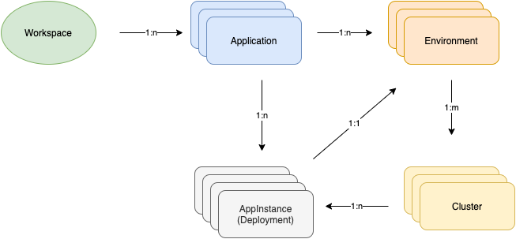
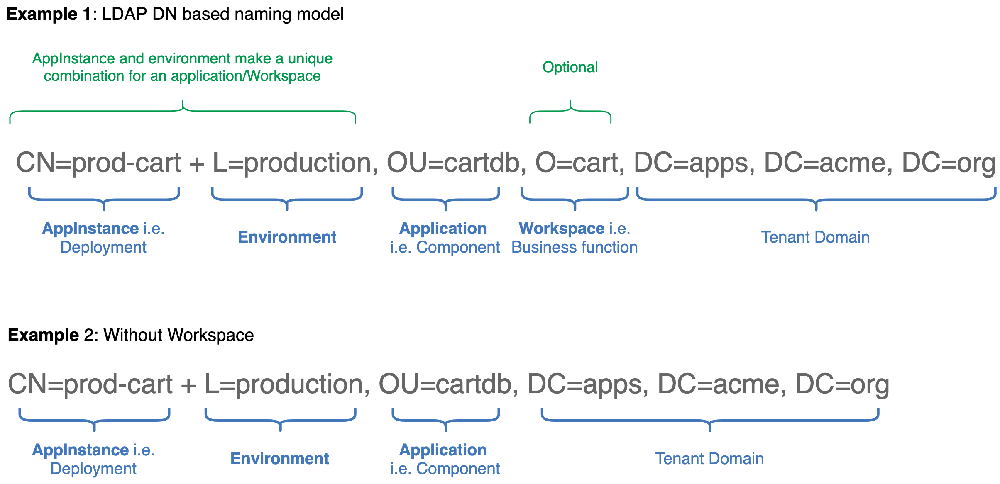

# Identities

User Identities
===============

User Representation
-------------------
TrustFabric representation leverages OAuth2, OIDC and UMA2 specifications for standardization of access delegation and for identity claims. User identity representation implementation is outside the scope of this specification. Objective of the specification is to provide interoperability via adoption of standards (i.e. OIDC, UMA2 and OAuth2).
User subject claim must use a unique identifier. It is recommended to follow LDAP Distinguished name syntax for user identities, though it is not mandatory. Alternative unique identifiers e.g. Email can also be used as subject claim.

User Tokens
-----------
Although specification does not provide mechanism to authenticate users, it provides integration with OIDC specifications and it leverages JWT based identity and Access Tokens.  
***Note**: Please check the applicable changes to the **/token** endpoint request for the token request flow for the **Authorization** header and value of the client credentials.*

Application Identities
======================
Most significant aspect of TrustFabric specification is modeling of identities for Cloud Native Applications. Identity model plays a critical role in establishing a secure fabric for application interactions.

Application Model
-----------------
Cloud Native Application Model is a highly flexible and easy to establish based on deployment environment. Model definition requires establishing a mapping for core entities that identify application.

### Entities

#### Workspace
Workspaces are business functions that provide trust boundaries for systems contained in it. Typically workspace is a collection of applications, services and systems implemented to support a business function. E.g. an e-commerce catalog is a business function that may have a web front-end application, services implementing catalog APIs and databases for persisting the entries.

#### Application
Application is typically an independent unit of execution that can be deployed and scaled. Application definition here includes web-applications, services, jobs, databases etc. In the e-commerce workspace above web-application, Services, databases are represented applications in this specification.

#### AppInstance
AppInstance (Application Instance) is the deployment of an application in a given environment with a specific version of code/binaries. It is a collection of environment, configuration and source code that is executing the desired function. Kubernetes  deployment is an example of an AppInstance.

#### Environment
Every application goes through PDLC and thus gets deployed in different environments,  e.g. it is developed, tested before being deployed in a customer facing environment. All these phases typically represent life-cycle state and security policies typically try to restrict these life-cycles using environments. An application can have multiple life-cycles associated where it is deployed. An AppInstance will always be associated with an environment.

#### Cluster
Cluster is a group of compute nodes (VMs, Hosts) where AppInstances are deployed. In cloud native world, cluster will map to a Kubernetes cluster. Cluster identification is essential when there are multiple clusters for deploying AppInstances.

#### Entity Association

A workspace will have one or more applications. An application can have one or more AppInstances(deployments), each corresponding to a specific environment. Environment can be hosted using multiple clusters. AppInstance can reside in a cluster, but cluster can host multiple AppInstances.

Applications have characteristics which could include teams, source code/image, deployments, interactions etc., these characteristics can be used to identify and represent the application components. TrustFabric focuses on providing flexible mechanisms for representing applications using these characteristics. Application identity is implemented using JWT tokens and provides a consistent representation similar to user identities in OIDC/OAuth2 specification. Application can obtain and use derived identities e.g. Kerberos tokens or X.509 certificates  using TrustFabric identity. X.509 certificates are used to represent the server identity. X.50 certificates, Kerberos tokens and JWT tokens maintain one consistent subject representation model based on X.500 directory specifications for distinguished names.

Application Subject Representation
----------------------------------
TrustFabric uses the directory naming model based on distinguished names to represent application identity subject. Model is based on X.500 specification and LDAP DN RFC 4514 and RFC 2253. JWT subject (sub) claim, X.509 subject and Kerberos principal are represented using this naming. Few examples of identity subjects are shown below.

Key aspects to note:
1. Workspace is optional. If present must be unique under tenant domain
1. Application name must be unique under workspace. If workspace is missing, it should be unique for the tenant domain 
1. Tenant domain component is will vary for each enterprise. Avoid using multiple tenant domains in your deployment as it provides a strict and less flexible isolation
1. Adding `dc=apps` and `dc=users` can be a good practice to isolate apps and users under tenant `dc=acme,dc=com`

Quick Note of LDAP DNs:

1. LDAP `DN` (Distinguished name) is formed by adding all `RDN` values (Relative distinguished name) from child (left) to parent(right) separated by `,` (comma). Spaces before and after `,` are optional and ignored unless escaped (Please refer LDAP RFC 4514)
1. Every LDAP entry has a unique RDN under a parent
1. Each RDN consists of multiple RDN Components joined using `+` (plus) sign. Most RDN values will have just one component. Spaces before and after `+` are optional and ignored unless escaped (Please refer LDAP RFC 4514)
1. Each RDN component is a `key` and `value` pair separated by `=` (equal) sign. Spaces before and after `=` are optional and ignored unless escaped (Please refer LDAP RFC 4514)
1. Do not use a string parser or string match to compare `DN` or `RDN` values. Instead implement a DN comparator provided by LDAP SDK being used.
1. In LDAP each RDN value corresponds to a object with components being attribute/value pair of that object. Object may have more attribute/values pairs and the object is created as composition of multiple object-classes (just like OOP).
1. TrustFabric only uses LDAP DN syntax only.  *Use of LDAP is completely optional and in many cases not required*.

Mapping Identities
==================
TrustFabric allows identity creation via mappings. This allows easier and flexible adoption of identity representation in your environment.

Naming
------
LDAP DN (distinguished naming) syntax is used for representing the application identities. Objects used for representing application identity can be modelled in many ways. This specification covers two mechanisms as reference.
1. Mapping based on LDAP
1. Mapping based on Kubernetes CRDs

Mapping Identities in LDAP
---------------------------
LDAP mapping is needed if your organization uses LDAP directories or IdM/IAM systems backed by LDAP directories. LDAP based identity representation makes it easier to achieve federation for application identities and can also be leveraged to build application catalog.
Please refer to [LDAP Schema section](./LdapSchema.md) for LDAP based identity modelling.

Mapping Identities in Kubernetes
--------------------------------
In Kubernetes following objects are available for mapping applications:
1. Clusters
1. Namespaces
1. Deployments

**Important**: TrustFabric is a federated implementation for application and user identities. Based on your implementation, additional controls may be required to implement unique identities across a multi-cluster Kubernetes infrastructure.
