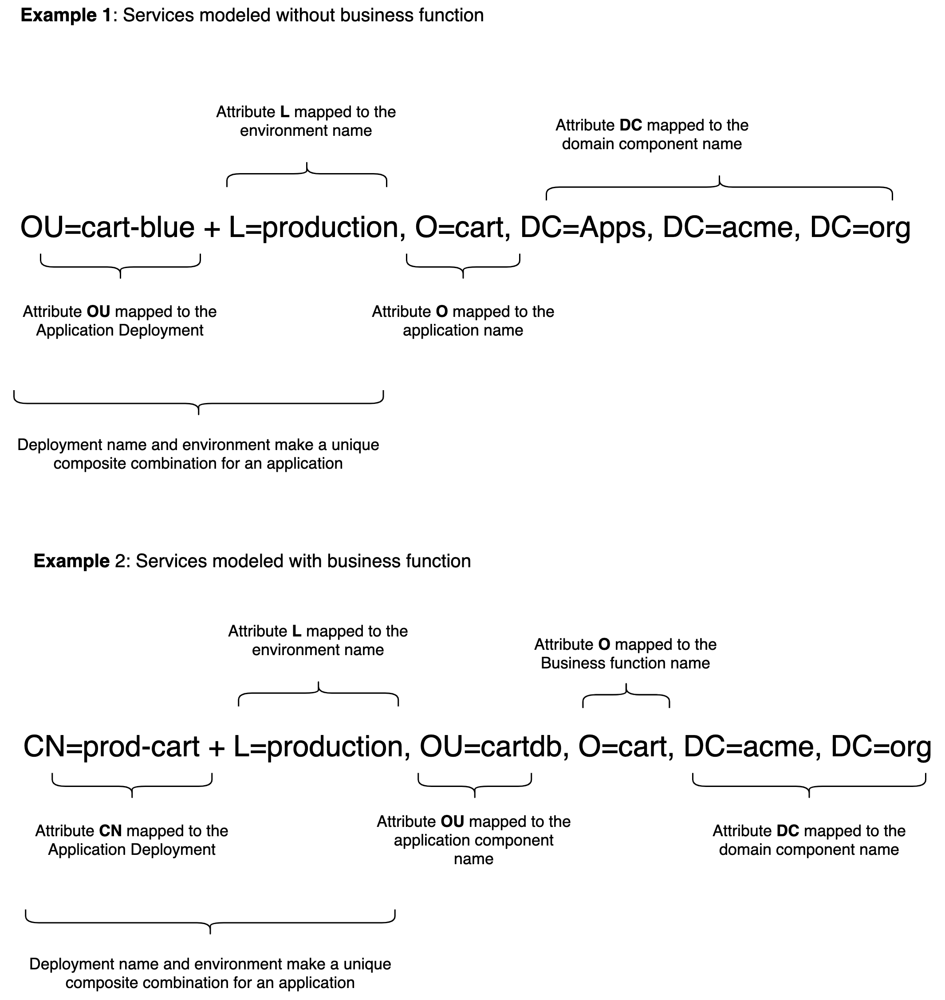
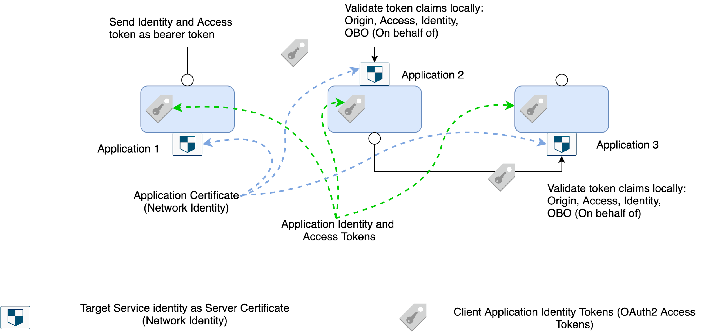

# TrustFabric Overview

Introduction
============

TrustFabric is an open-source specification and implementation for
Application Identity and Access management. It secures interactions
between applications and between users and applications.

TrustFabric establishes the application organization and life-cycle
model for a strong application identity representation. The
specification itself is a collection of industry standards, aligned to
provide very high interoperability and security to help organizations
leverage their investments in existing identity and security solutions.

Challenges
==========

Enterprises typically have a multitude of heterogeneous applications
(a.k.a. services). These applications have different architecture, they
speak different protocols, they are built using different programming
languages and they have different authentication and access
requirements. Enterprises may also have specialized deployment topology,
multiple lifecycles and different security zones (e.g. SOX, PCI) for
hosting applications.

Summarizing these challenges:

-   Multiple Authentication mechanisms

-   Lack of standardization of Application Identity and Verification

-   Lack of unified policies and rules for access and authorizations

-   Scale and time-sensitivity

To solve these challenges, a comprehensive, secure, interoperable and
flexible approach is needed.

Goals
=====

1.  Define models to align application lifecycle for strong identity and
    access

2.  Standardize identity representation, verification, and validation

3.  Federate application identity across clusters

4.  Standardize authentication for User-to-App, App-to-App and
    User-to-App-to-App scenarios

5.  Standardization and implementation of access control and
    fine-grained authorizations for cloud-native workloads

6.  Achieve interoperability and ease of adoption

7.  Reference implementation

Overview
========

Representing application identity
---------------------------------

Typically, business functions consist of multiple components e.g.
Frontend Web/Mobile, Application APIs, databases etc. These components
are maintained by different teams and typically are a combination of
multiple technologies (micro-services, stateful workloads etc). Each of
these components (a.k.a. applications) can have multiple deployments
(a.k.a. AppInstances) in different zones.

Applications have characteristics which could include teams, source
code/image, deployments, interactions etc., these characteristics can be
used to identify and represent the application components. TrustFabric
focuses on providing flexible mechanisms for representing applications
using these characteristics. Application identity can be represented
using OAuth2 JWT tokens, X.509 certificates and Kerberos tokens.

### Application Identity Subject representation

TrustFabric uses the directory naming model based on distinguished names
to represent application identity subject. Model is based on X.500
specification and LDAP DN RFC 4514 and RFC 2253. JWT subject (sub)
claim, X.509 subject and Kerberos principal are represented using this
naming. Few examples of identity subjects are shown below.

Bootstrapping application identity
----------------------------------

Applications share identity with other applications on the network for
app-app interactions. Application needs to be bootstrapped with identity
for these interactions. TrustFabric is a passwordless mechanism and
implements a two step mechanism to establish identity.

-   Referral identity injection via trust delegation

-   Obtaining Identity and Access tokens for interactions

As part of referral identity injection, application deployment is
provided with a referral identity token by TrustFabric, based on trust
declared by trusted referrer e.g. DevOps managing applications or k8s
operators etc. This referral identity can later be used by application
to obtain identity and access tokens. TrustFabric leverages OAuth2 to
implement token request flows. The referral tokens are treated as
code-grant issued by DevOps or by Operators. Code-grant delivery can be
done via

-   OAuth2 code-grant flow

-   Direct injection to application (e.g. Via secrets in Kubernetes)

All tokens in TrustFabric specification are short duration tokens, which
requires a mechanism to re-evaluate trust and replenish the referral
tokens to the application.

Once application receives the referral token (a.k.a. Code grant), it can
use the token flow to obtain access tokens with identity and
authorization claims.

Securing application interactions using TrustFabric 
---------------------------------------------------

Once the token bootstrapping is done, applications can interact with the
other services using the identity and access token obtained. Token
represents the complete identity of the client application and can be
validated locally by target service without external
interaction/dependencies. Since tokens are small duration tokens,
renewal will ensure updates on claims are available in the token.
TrustFarbic follows the OAuth2/JWT access token model, which is widely
adopted in the industry. It requires target service to implement TLS
endpoint with network identity of the service represented by the
Certificate DNS entry. This allows clients to authenticate the target
service identity. With both client and target service validating each
other, mechanism provides a strong authentication.

TrustFarbic Control Plane Components
------------------------------------

### Federated Control Plane Components

-   Federated Identity Stores (Application, Users, Groups, Zones)

-   Federated Policy Store (Admission, User-App, App-App,
    User-Resource,..)

-   Authentication and token services (OIDC, OAuth2, LDAP, KDC)

-   Key and Certificate Services

### Distributed Control Plane Components

-   Bootstrap Controllers (CodeGrant)

-   Admission Webhooks

-   Application Specific Sidecars (X.509, KRB keytab and
    Identity/AccessToken delivery)

Standards and Specifications
============================

1.  OAuth2.0 [[RFC 6749]](https://tools.ietf.org/html/rfc6749)

2.  Open ID Coneect Specifications: [[OIDC]](https://openid.net/developers/specs/)

3.  JWT profile for OAuth2.0 [[RFC 7523]](https://tools.ietf.org/html/rfc7523)

4.  ITU [[X.509]](https://www.itu.int/rec/T-REC-X.509/en)

5.  SASL for OAuth [[RFC 7628]](https://tools.ietf.org/html/rfc7628)

6.  X.500/LDAP DN representation [[RFC 4514]](https://tools.ietf.org/html/rfc4514)
