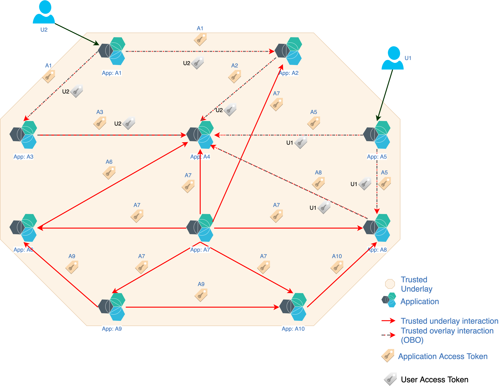

# Trusted Cloud Native Application Fabric

TrustFabric implements layered approach for implementing secure fabric of application interactions. 

Trusted Underlay
================
Application identities are established first using the bootstrapping and token negotiation. Once identity is established, these identities are used to establish connectivity to allowed services over TLS based on policies. This establishes a secure underlay interaction pattern for applications. As new services interactions are added or removed access patterns will change.
### Goals
*   Establish identities of all applications
*   Establish a *password-less* mechanism of application identity verification and validation
*   Establish interactions based on application access policies and delegation (On-behalf-of) policies
*   Secure the interaction using standard TLS based network connection. 
    *   Server certificate carries the attested network identity
    *   Client token carries the attested identity and access (interaction, delegation) policies

### Methods
Underlay identity for applications is specified using the JWT based access token. The access token is presented by client to provide the identity to server for verification, while server presents a X.509 certificate as part of the TLS handshake, which represents the server network identity. Specification supports following methods for application identity verification over network:
*   SASL chaining based Overlay (TLS and JWT Bearer Token). This is based on [RFC 7628](https://tools.ietf.org/html/rfc7628).
*   HTTPS (Server Cert) + Authorization header (Bearer Token). This mechanism is most common for HTTP based applications for authentication and authorization.
*   GRPC (Server Cert) + Bearer Token.

Trusted Overlay
===============
Users interact with applications and these applications may have to interact with other services on-behalf-of the user. These interactions help avoid a classic security concern with micro-services i.e. "Confused deputy". TrustFabric allows `obo` (On Behalf Of) claims and `azp` (authorized presenter) claims to allow applications to interact with other applications with user's identity.
### Goals   
*   Establish User Identity and User-Application delegation model
*   Establish multi level delegation via authorized presenter (`azp`) and authorized forwarder (`azf`) claims
*   Establish identification (headers, names etc) for underlay access token and overlay access tokens

### Methods
*   OIDC + OAuth2 for user identity and delegation
*   Underlay OAuth2 Access Tokens as client_secret for Overlay OIDC interactions
*   Delegation: TBD  

